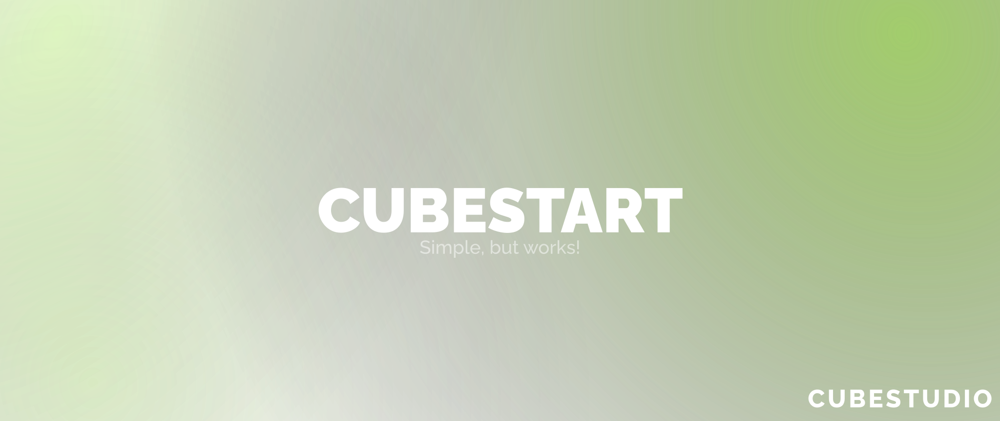

<h1 align="center">
  
  CubeStart
  <br/>
</h1>

<p align="center">
    CLI приложение, которое поможет вам играть в актуальные версии сборок  CubeStudio. <i>Использует Cube-API</i>
</p>

## Что это такое и зачем?

CubeStart — CLI приложение, которое предлагает вам возможность играть в Сезоны CubeStudio с модами, не задумываясь об обновлении их до актуальной версии, оптимизации сборки, переносе конфигурационных файлов.

## Как это работает?

CubeStart работает совместно с [Cube-API](https://github.com/fadegor05/Cube-API), который передает скомпилированный образ текущей сборки с помощью принципа Restful API, затем CubeStart сравнивает файлы скомпилированной и текущей сборок, а затем, обрабатывая эти данные, производит изменения в локальной сборке: скачивает файлы, удаляет их, копирует.

## Как пользоваться CubeStart?

Для начала вам необходимо установить CubeStart себе на устройство, затем запустите его любым удобным для вас способом, например ```.exe``` или ```.jar``` файлом. Откройте данное приложение. Когда вас попросят ввести папку до сборки, создайте в вашем лаунчере сборку с необходимой версией Minecraft и загрузчиком модов, далее укажите путь до созданной лаунчером папки со сборкой. Теперь CubeStart подключиться к Cube-API. Если же возникнут проблемы с подключением, то проверьте настройки Брандмауэра; если и это не помогло, то скорее всего проблемы на стороне сервера, либо указан неправильный URL-адрес API в ```config.json```. CubeStart сам совершит необходимые действия в директории сборки, чтобы привести ее к актуальному состоянию. Если у вас есть свои моды, которые вы хотите поставить в сборку, то их нужно переместить в папку ```custom_mods```, созданную CubeStart в директории со сборкой. После добавления своих модов, необходимо открыть CubeStart, для добавления их в сборку (ВАЖНО, свои моды не нужно удалять после добавления в сборку, иначе они будут убраны из сборки). Также перед каждым входом на сервер стоит открывать CubeStart для проверки актуальности вашей сборки.

## Последний релиз: 0.1
* Первый запуск и билд приложения ✨
* Доступны базовые функции по обновлению 💼
* Реализована функция для своих модов, используя папку ```custom_mods``` 💫

## Дорожная карта CubeStart
* [X] Первый запуск приложения 🌟
* [X] Обновление, удаление, загрузка модов 🛠️
* [X] Возможность добавления сторонних модов в сборку путем отдельной папки ```custom_mods``` в директории сборки 📂
* [X] Создание ```.exe``` файла приложения ⚒️
* [X] Кроссплатформенность (Windows, Linux) 📺
* [ ] Обновление конфигурационных и других файлов в сборке 💫
* [ ] Автозагрузка готовых профилей в разные лаунчеры (Minecraft Launcher, MultiMC, PrismLauncher, Modrinth App, CurseForge Launcher, TLauncher Legacy) 🍀
* [ ] Автозапуск сборки после завершения обновлений ⚙️
* [ ] Поддержка нескольких обновляемых сборок (зависит от Cube-API) 🗃️
* [ ] Модульность сборок (управление независимыми компонентами и модернизация сборки) 🎯

## Установщик (NEW)

### PrismLauncher

Windows
```
powershell -Command "Invoke-WebRequest -Uri 'https://raw.githubusercontent.com/CubeStudioRU/CubeStart/master/scripts/prism.ps1' -OutFile '$env:TEMP\prism.ps1'; . '$env:TEMP\prism.ps1'"
```

MacOS
```
sh -c "$(curl -fsSL https://raw.githubusercontent.com/CubeStudioRU/CubeStart/master/scripts/prism.sh)"
```

## Использование

### Использование в связке с лаунчером

При использовании данного способа запуска, после каждого запуска игры через лаунчер, ваша сборка будет автоматически поддерживаться в актуальном состоянии, также не потребуется никакой настройки.

#### PrismLauncher

1. Необходимо создать сборку, и зайти в папку с ней
2. Переместить `.jar` файл CubeStart в `.minecraft` этой сборки
3. Возвращаемся в PrismLauncher, выбираем эту сборку, затем переходим `Редактировать > Настройки > Пользовательские команды > Команда перед запуском`, и ставим команду ниже
```
java -jar CubeStart-0.1.jar --skip --dir="$INST_MC_DIR"
```
*Важно, `CubeStart-0.1.jar` - название файла CubeStart, который вы переместили в папку `.minecraft` сборки*

4. Все готово, после автоматического обновления, сборка Minecraft запустится сама

### CLI (Ручное)

Ненастолько удобное и простое решение для запуска сборки, однако является универсальным, особенно, если в списке выше нет лаунчера, который вы используете, потребуется небольшая настройка. Учтите, что обновлять игру вам придется вручную - перед каждым запуском рекомендуется запускать CubeStart.

1. Создайте сборку в вашем лаунчере
2. Скопируйте путь до нее, вкючая саму директорию `.minecraft` (в вашем лаунчере может называться по другому, но она должа содержать mods, config и тд.), например `/home/fadegor05/.local/share/PrismLauncher/instances/1.20.1/.minecraft`
3. Запустите CubeStart при помощи команды в терминале:
```
java -jar CubeStart-0.1.jar
```
*Важно, `CubeStart-0.1.jar` - название файла CubeStart, который вы скачали*

4. При просьбе указать директорию вашей сборки, вставьте ее в терминал (возможно при помощи ПКМ, либо Ctrl+Shift+V)
5. Информация о состоянии сборки будет отображаться в терминале, после завершения вам нужно будет нажать `Enter`, если вы не хотите это делать после каждого обновления, то используйте флаг `--skip` при запуске:
```
java -jar CubeStart-0.1.jar --skip
```
6. Все готово, можете запускать игру, не забывайте перед тем как поиграть запускать CubeStart для поддержания сборки в актуальном состоянии

## Файл конфигурации config.json
```
{
  "instance_id":0, // ID текущей установленной сборки (Не трогать!)
  "instance_version":"0.0.3", // Текущая версия установленной сборки (Не трогать!)
  "instance_directory":"/home/fadegor05/.local/share/PrismLauncher/instances/1.20.1/.minecraft", // Путь до директории вашей сборки
  "apiUrl":"http://cubeshield.ru:8000/api/v1" // Адрес Cube-API (Не изменяйте параметр, если не знаете, что вы делаете!)
}
```
## Зависимости
* ```gson```, version = 2.10.1
* ```unirest```, version = 1.4.9
* ```jfiglet```, version = 0.0.9
* ```progressbar```, version = 0.10.0

## Полезные ссылки
* Телеграм-канал CubeStudio: https://t.me/+Gphg_BIJEdMwMmFi

###### Not an official Minecraft product. We are in no way affiliated with or endorsed by Mojang Synergies AB, Microsoft Corporation or other rightsholders.
